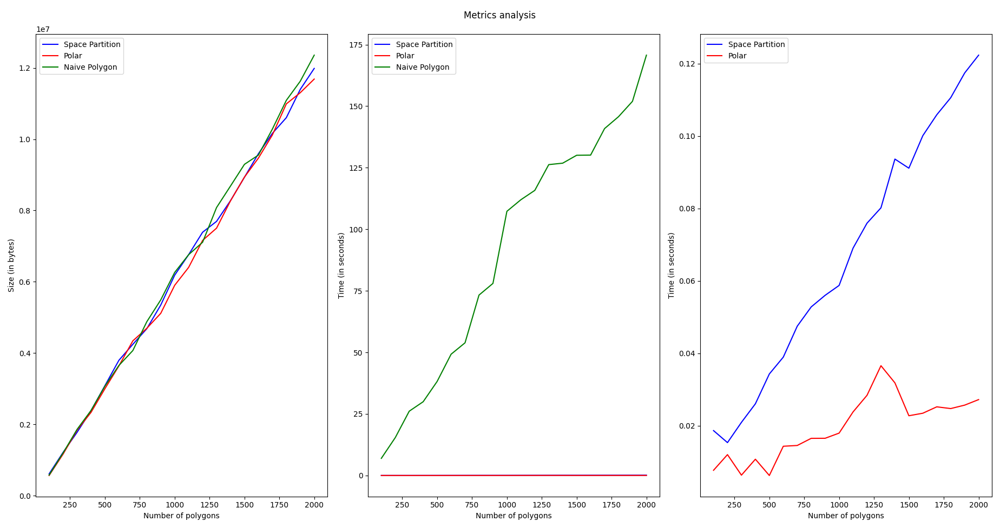

# Polygon Generator
A Program to generate Random Polygons using three different algorithms, write them to a file in WKT format and visualise them using OpenGL.
## Project Structure
The `src` folder contains all the source code for this project. It consists of the following files:
1. **Driver.cpp** which contains the main function
2. **Graphics.cpp** which contains the OpenGL graphing routines
3. **Polygon.hpp** which contains the Polygon class definition
4. **Polygon.cpp** which contains the definitions of the Polygon class member functions
5. The files **NaivePolygonGenerator.cpp, SpacePartition.cpp and Polar.cpp** contain the three random polygon generation algorithms
6. **WKT_writer.cpp** contains the routines to write the generated Polygons to a file in the `WKT` format

The `Profiler.sh` file contains a shell script that can be used to profile our program.

The files `Distribution.py` and `Metrics.py` are used for graphing the Distribution of the generated polygons and visualising the metrics generated after profiling respectively.

The `Images` folder contains few screenshots of the generated polygon maps.

## Dependencies
- A C++ compiler like g++ or clang
- popt.h (for command line input)
- OpenGL (for visualising the generated polygons)
- Python 3 interpreter with all the packages in `requirements.txt` installed
## Compiling and running
Install the dependencies:

```bash
$ sudo apt install libpopt-dev freeglut3-dev
$ python3 -m pip install -r Requirements.txt
```
Compile using the make utility:

```bash
$ make polygonGenerator -j$(($(nproc)+1))
```

Run the following command to print the help doc for the program:
```bash
$ ./bin/polygonGenerator -?
```

Run the Profiler using:
```bash
$ chmod +x ./Profiler.sh
$ ./Profiler.sh 5
```
Here, the 5 represents the number of iterations the Profilers runs the program. In any iteration `i`, `100i` polygons are generated using each of the three algorithms.

## Sample Maps

## Samples of Distribution Plots

## Sample of Metrics Analysis
