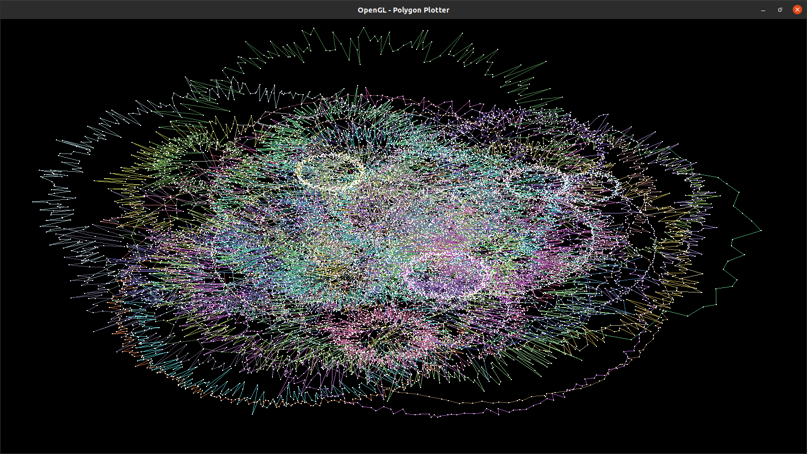
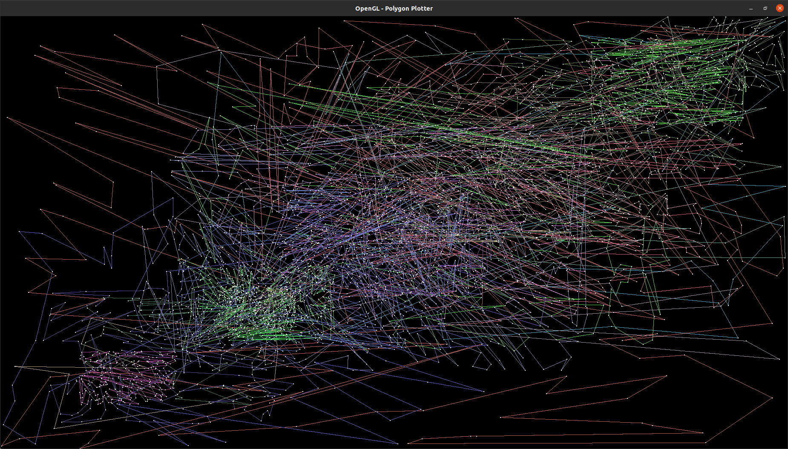
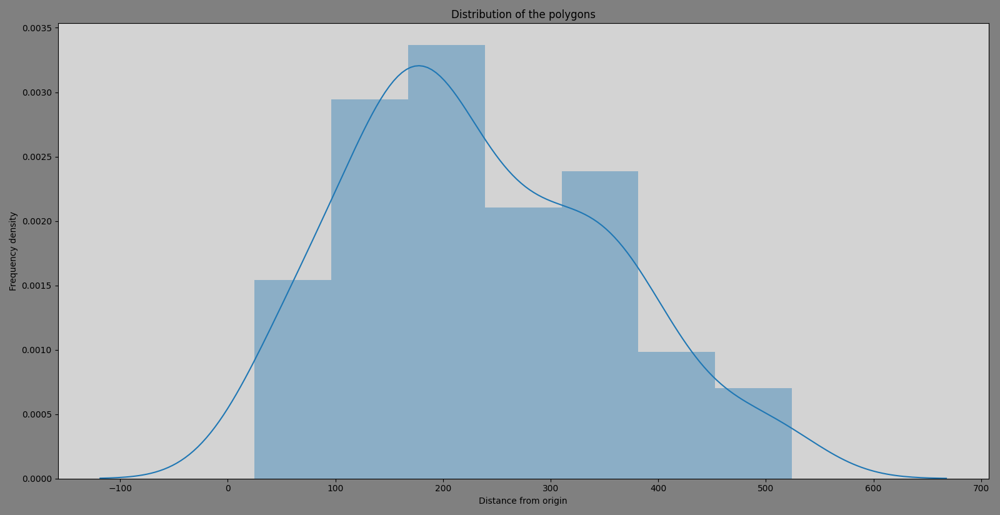
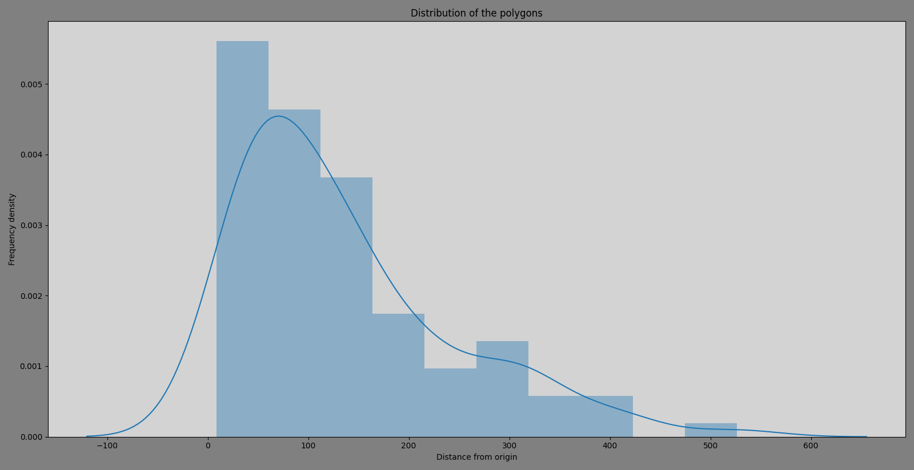
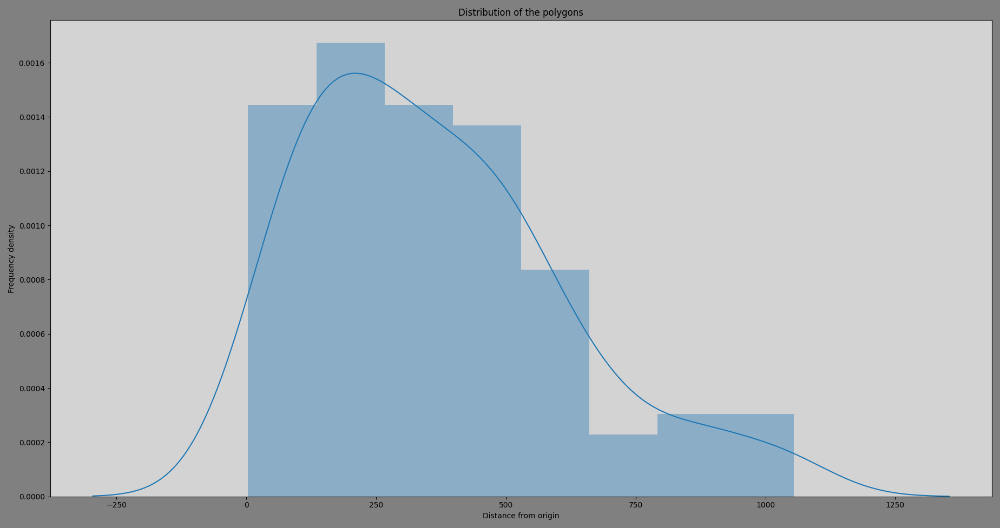

# Polygon Generator
A Program to generate Random Polygons using three different algorithms, write them to a file in WKT format and visualise them using OpenGL.
## Project Structure
The `src` folder contains all the source code for this project. It consists of the following files:
1. **Driver.cpp** which contains the main function
2. **Graphics.cpp** which contains the OpenGL graphing routines
3. **Polygon.hpp** which contains the Polygon class definition
4. **Polygon.cpp** which contains the definitions of the Polygon class member functions
5. The files **NaivePolygonGenerator.cpp, SpacePartition.cpp and Polar.cpp** contain the three random polygon generation algorithms
6. **WKT_writer.cpp** contains the routines to write the generated Polygons to a file in `WKT` format

The file `Profiler.sh` contains a shell script that can be used to profile our program.

The files `Distribution.py` and `Metrics.py` are used for graphing the Distribution of the generated polygons and visualising the metrics generated after profiling respectively.

## Dependencies
- A C++ compiler like g++ or clang
- popt.h (for command line input)
- OpenGL (for visualising the generated polygons)
- Python 3 interpreter with all the packages in `requirements.txt` installed
## Compiling and running
Install the dependencies:

```bash
$ sudo apt install libpopt-dev freeglut3-dev
$ python3 -m pip install -r Requirements.txt
```
Compile using the make utility:

```bash
$ make polygonGenerator -j$(($(nproc)*2))
```

Run the following command to print the help doc for the program:
```bash
$ ./bin/polygonGenerator -?
```

Compile the Shared Library using:
```bash
$ make polygonGenerator_SharedLibrary -j$(($(nproc)*2))
```

Run the Profiler using:
```bash
$ chmod +x ./Profiler.sh
$ ./Profiler.sh 5
```
Here, the 5 represents the number of iterations the Profilers runs the program. In any iteration `i`, `100i` polygons are generated using each of the three algorithms.

## Metrics Analysis
The leftmost graph shows how the size of the WKT file changes as the number of polygons generated increases. The other two plots show a comparison of time taken by the three algorithms for generating large number of polygons. 


## Sample Maps
These are a few graphs generated by plotting multiple random polygons on the same OpenGL window
(Note: The random variables are sampled from different distributions)
<table>
    <tr>
        <td>Sampling distribution</td>
        <td>Polar Algorithm</td>
        <td>Space Partition Algorithm</td>
        <td>Naive Polygon Algorithm</td>
    </tr>
    <tr>
        <td>Uniform</td>
        <td valign="top"></td>
        <td valign="top"></td>
        <td valign="top"></td>
    </tr>
    <tr>
        <td>Binomial</td>
        <td valign="top"></td>
        <td valign="top"></td>
        <td valign="top"></td>
    </tr>
    <tr>
        <td>Geometric</td>
        <td valign="top"></td>
        <td valign="top"></td>
        <td valign="top"></td>
    </tr>
    <tr>
        <td>Poisson</td>
        <td valign="top"></td>
        <td valign="top"></td>
        <td valign="top"></td>
    </tr>
    <tr>
        <td>Normal</td>
        <td valign="top"></td>
        <td valign="top"></td>
        <td valign="top"></td>
    </tr>
</table>

## Samples of Distribution Plots

<table>
  <tr>
    <td>Sampling distribution</td>
    <td>Polar Algorithm</td>
    <td>Space Partition Algorithm</td>
    <td>Naive Polygon Algorithm</td>
  </tr>
  <tr>
    <td>Uniform</td>
    <td valign="top"></td>
    <td valign="top"></td>
    <td valign="top"></td>
  </tr>
  <tr>
    <td>Binomial</td>
    <td valign="top"></td>
    <td valign="top"></td>
    <td valign="top"></td>
  </tr>
  <tr>
    <td>Geometric</td>
    <td valign="top"></td>
    <td valign="top"></td>
    <td valign="top"></td>
  </tr>
  <tr>
    <td>Poisson</td>
    <td valign="top"></td>
    <td valign="top"></td>
    <td valign="top"></td>
  </tr>
  <tr>
    <td>Normal</td>
    <td valign="top"></td>
    <td valign="top"></td>
    <td valign="top"></td>
  </tr>
 </table>
